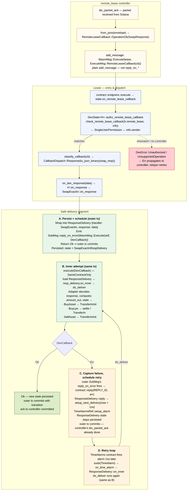

# Remote-Lease Callback — Execution Flow inside a Lease Instance

Trace of a swap callback delivered to the Lease contract via
`ExecuteMsg::RemoteLeaseCallback`. The focus is the **safe-delivery
segment** (`ResponseDelivery` + `reply_on_error` + `TimeAlarms` retry
loop) — boxes **A**–**D** below. Preserved verbatim from today's
SudoMsg path per ADR `0001-remote-lease-protocol.md` §3.7.1 / §9.5; only
the outer transport and the auth gate change with #141.

## Whole flow

## What the four safe-delivery boxes guarantee

### A — Persist + schedule (outer tx)

The lease's `on_response` does the absolute minimum: store the raw
response inside `ResponseDelivery` state, emit a *self-call* `SubMsg::reply_on_error(DexCallback)`, return `Ok`.

Once this returns `Ok`, the outer transaction — which also contains the
controller's `ibc_packet_ack` write — commits atomically. The controller
**never sees an `Err`** originating in the inner business logic; only
storage / serialization errors here could propagate (and that's the
infallibility contract the implementation upholds).

### B — Inner attempt (same tx, sub-message)

`DexCallback` runs as a sub-message of the outer tx. It loads the
persisted `ResponseDelivery`, decodes the buffered response, computes
the swap outcome (e.g. `amount_out`), and transitions to the next state.
If this branch succeeds, the outer tx commits with the new state and
the `ResponseDelivery` wrapper is gone in one atomic step.

Permission is `SameContractOnly` — `DexCallback` is unreachable from
any external caller.

### C — Capture failure, schedule retry

If `DexCallback` returns `Err`, the **outer** SubMsg's
`reply_on_error` fires `contract::reply(REPLY_ID, err)`. `ResponseDelivery::reply` calls `setup_next_delivery` which schedules a
`TimeAlarms` alarm `now + 1ns`. The `ResponseDelivery` state stays
persisted (response still buffered, no transition yet); the outer tx
still commits cleanly with the alarm scheduled.

Critical property: the controller's `ibc_packet_ack` is **already
done**. The relayer is not involved in recovery. From this point on,
the retry is a purely local concern of the lease + `TimeAlarms`.

### D — Retry loop

The `TimeAlarms` contract fires the alarm. The lease's `on_time_alarm`
routes into `ResponseDelivery::on_inner` again, which re-runs the same
`do_deliver` step as B. Either it succeeds — transition out, normal
state — or `reply_on_error` fires again and schedules another `now +
1ns` alarm. The loop continues until success.

`ExecuteMsg::Heal()` is the operator escape hatch if the loop is stuck
on a permanently-unrecoverable state.

## Three properties that make this safe

1. **Outer `Ok` is unconditional.** The lease's `on_response` is
   engineered so its only failure paths are storage / serialization
   errors. Real business-logic failure is deferred to B/C. The
   controller's ack-commit is decoupled from inner success.

2. **No duplicate state writes on failure.** B's failure rolls back its
   sub-message's state mutations — only the C path
   (`setup_next_delivery`) commits to the outer tx, alongside the
   still-buffered `ResponseDelivery`. There are no half-applied
   transitions ever visible on-chain.

3. **The retry is host-driven, not relayer-driven.** Once the outer ack
   commits, the relayer is done with this packet. Recovery is a local
   concern of the lease + `TimeAlarms` contract. The controller is
   never invoked again for the same packet.

## What changed in #141 (vs. today's SudoMsg path)

| Stage | Today (SudoMsg) | After #141 (ExecuteMsg::RemoteLeaseCallback) |
|-------|-----------------|----------------------------------------------|
| Outer transport | `SudoMsg::Response` (chain-delivered) | `ExecuteMsg::RemoteLeaseCallback` (controller-delivered via `WasmMsg::Execute`) |
| Auth gate | Implicit (Sudo privilege) | `info.sender == remote_lease` at `DexState::on_remote_lease_callback` |
| Classify | `data` enters directly into `on_dex_response` | `classify_callback` projects variant → `CallbackDispatch::Response/Error/Timeout` |
| A–D safe-delivery boxes | unchanged | unchanged |

## Open seam closed by ibc-solray#142

The decoder at step B currently expects the chain's protobuf
`MsgSwapExactAmountInResponse` shape (Osmosis / Astroport). The
`RemoteLeaseCallback::OperationOk(SwapResponse)` path delivers JSON
bytes from `remote_lease::response::SwapResponse`. ibc-solray#142 will
switch the in-lease decoders from the protobuf shape to the JSON shape
when the lifecycle calls move to `remote_lease` stubs.

Until then:

- The auth-gate, the classify step, and the dispatch wiring are
  exercised by the in-crate unit tests (`packages/dex/src/response.rs`,
  `contracts/lease/src/contract/state/dex.rs`).
- The end-to-end public-API path is exercised in
  `tests/src/lease/remote_lease_callback.rs` against the BuyAsset
  swap-pending state, covering matched/mismatched sender and the
  `OperationTimeout` / `OperationErr` arms (which reach the real
  `on_dex_timeout` / `on_dex_error` and schedule a retry SubMsg). The
  `OperationOk` arm is intentionally deferred to #142 because of the
  protobuf-vs-JSON shape mismatch.
