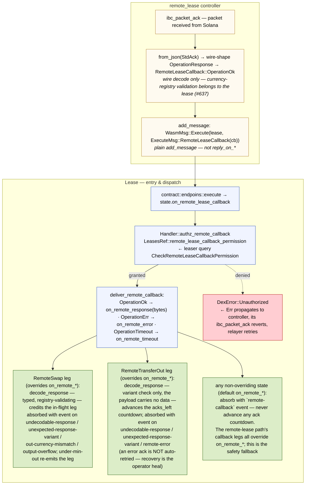
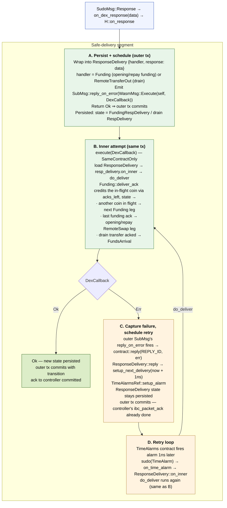

# Remote-Lease Callback — Execution Flow inside a Lease Instance

Trace of a callback delivered to the Lease contract via
`ExecuteMsg::RemoteLeaseCallback`. Two distinct segments:

1. **Controller → lease dispatch** — auth at the lease, then direct
   routing into the state's `on_remote_*` entry points. The remote-swap
   leg processes the acknowledgment **directly** — there is no
   `ResponseDelivery` hop on this path; content problems are absorbed
   with events so the controller's ack always commits.
2. **Safe-delivery segment** (`ResponseDelivery` + `reply_on_error` +
   `TimeAlarms` retry loop, boxes **A**–**D**) — applies to the
   **sudo-delivered legs** driven by `SudoMsg` (the opening and repay
   funding transfers to the Solana-side `LeaseAuthority`, and the
   drain-home transfers — all riding the paired ICS-20 transfer channel,
   no Interchain Account). Controller callbacks never route through it.

## Controller → lease dispatch



A synchronous `Err` escapes the lease only for faults whose retry
belongs to the relayer: the auth mismatch above, serialization, and
storage failures. Everything content-shaped — a payload that does not
decode, names a currency outside the registry, carries the wrong
operation variant, or overflows — is absorbed with a distinct event
reason so the controller's `ibc_packet_ack` commits.

## Safe-delivery segment — sudo-delivered transfer legs (`SudoMsg` path)



## What the four safe-delivery boxes guarantee

### A — Persist + schedule (outer tx)

The lease's `on_response` does the absolute minimum: store the raw
response inside `ResponseDelivery` state, emit a *self-call* `SubMsg::reply_on_error(DexCallback)`, return `Ok`.

Once this returns `Ok`, the outer transaction — which also contains the
controller's `ibc_packet_ack` write — commits atomically. The controller
**never sees an `Err`** originating in the inner business logic; only
storage / serialization errors here could propagate (and that's the
infallibility contract the implementation upholds).

### B — Inner attempt (same tx, sub-message)

`DexCallback` runs as a sub-message of the outer tx. It loads the
persisted `ResponseDelivery` and runs the wrapped handler against the
buffered response: the `Funding` leg credits the in-flight coin via
`acks_left` (the ICS-20 success payload carries nothing to decode) and
either schedules the next coin or, on the last ack, advances to the
opening/repay `RemoteSwap` leg; the drain's `RemoteTransferOut` advances
toward `FundsArrival`. If this branch succeeds, the outer tx commits with
the new state and the `ResponseDelivery` wrapper is gone in one atomic step.

Permission is `SameContractOnly` — `DexCallback` is unreachable from
any external caller.

### C — Capture failure, schedule retry

If `DexCallback` returns `Err`, the **outer** SubMsg's
`reply_on_error` fires `contract::reply(REPLY_ID, err)`. `ResponseDelivery::reply` calls `setup_next_delivery` which schedules a
`TimeAlarms` alarm `now + 1ns`. The `ResponseDelivery` state stays
persisted (response still buffered, no transition yet); the outer tx
still commits cleanly with the alarm scheduled.

Critical property: the controller's `ibc_packet_ack` is **already
done**. The relayer is not involved in recovery. From this point on,
the retry is a purely local concern of the lease + `TimeAlarms`.

### D — Retry loop

The `TimeAlarms` contract fires the alarm. The lease's `on_time_alarm`
routes into `ResponseDelivery::on_inner` again, which re-runs the same
`do_deliver` step as B. Either it succeeds — transition out, normal
state — or `reply_on_error` fires again and schedules another `now +
1ns` alarm. The loop continues until success.

`ExecuteMsg::Heal()` is the operator escape hatch if the loop is stuck
on a permanently-unrecoverable state.

## Three properties that make this safe

1. **Outer `Ok` is unconditional.** The lease's `on_response` is
   engineered so its only failure paths are storage / serialization
   errors. Real business-logic failure is deferred to B/C. The
   controller's ack-commit is decoupled from inner success.

2. **No duplicate state writes on failure.** B's failure rolls back its
   sub-message's state mutations — only the C path
   (`setup_next_delivery`) commits to the outer tx, alongside the
   still-buffered `ResponseDelivery`. There are no half-applied
   transitions ever visible on-chain.

3. **The retry is host-driven, not relayer-driven.** Once the outer ack
   commits, the relayer is done with this packet. Recovery is a local
   concern of the lease + `TimeAlarms` contract. The controller is
   never invoked again for the same packet.

## Transport comparison (transfer legs vs. remote legs)

| Stage | Transfer legs (SudoMsg) | Remote legs (ExecuteMsg::RemoteLeaseCallback) |
|-------|--------------------|-----------------------------------------------|
| Outer transport | `SudoMsg::Response` (chain-delivered ICS-20 transfer ack — funding + drain) | `WasmMsg::Execute` from the controller's `ibc_packet_ack` / `ibc_packet_timeout` |
| Auth gate | Implicit (Sudo privilege) | Leaser query (`CheckRemoteLeaseCallbackPermission` vs `Config.remote_lease_controller`) |
| Dispatch | `data` enters `on_dex_response` → safe-delivery boxes A–D | `deliver_remote_callback` → `on_remote_response/error/timeout`; `RemoteSwap` processes directly, the drain leg absorbs |
| Content failure | retried locally via the A–D loop | absorbed with a distinct event reason; ack commits |

## Outbound open-side lifecycle (issue #142)

The lease now drives the remote-lease channel directly for the open flow.

```
RequestLoan ──open loan──▶ OpenLease
                              │
                              │ Factory::open → controller → IBC packet
                              │
                              ▼
                  ┌───────────────────────┐
                  │ controller ack (UNORDERED) │
                  └───────────────────────┘
                     │             │
        OperationOk  │             │ OperationErr / OperationTimeout
        (OpenLease   │             │
        + PDA)       │             ▼
                     │       atomic batch: LPP repay + downpayment refund
                     │             + finalize_lease + emit
                     │             `wasm-ls-remote-lease-open-failed`
                     │             │
                     ▼             ▼
        super::buy_asset::start    OpenFailed  (terminal)
        (Funding: ICS-20 transfers authenticated late-ack absorber:
        to LeaseAuthority, no ICA;   emits `wasm-ls-remote-lease-late-ack`
        then swap legs via RemoteSwap)
```

`OpenLease::on_remote_lease_callback` authenticates `info.sender` via `LeasesRef::remote_lease_callback_permission` before dispatching, identical to the in-flight DexState gate documented above. `OpenFailed` runs the same check — every callback handler that returns `Ok` is authz-gated, regardless of idempotence.

`super::buy_asset::start` no longer opens an Interchain Account. It funds the open by ICS-20-transferring the downpayment and the principal to the lease's Solana-side `LeaseAuthority` over the paired transfer channel — the `Funding` leg (`dex::StateFundRemote`, one coin in flight at a time, `acks_left` countdown). Only after the last funding transfer's success-ack does the workflow advance to the opening swap legs, which run through the remote-lease controller (`RemoteSwap` — sequential single-coin legs, `acks_left` countdown, pinned per-leg `min_out`). The opened-state repay funds the same way (`buy_lpn` now also uses `dex::StateFundRemote`, bridging `remote_lease_id → LeaseAuthority` via `contract::state::remote_lease_host`), then swaps through the controller. The paid-close drain and the `CloseLease` run through the controller as well (next section); the liquidation and sell-asset customer-close swap legs are controller-based too (`dex::StateSwap`). What remains on the ICA machinery is only the now-dead legacy trx builders (`dex::Account.host` is `None` on the remote-lease path); their wholesale removal is deferred to #649.

**Funding-leg heal carries no per-emission nonce yet.** A timeout or error ack re-emits the single in-flight coin verbatim, and `Heal` does the same — but unlike the `RemoteSwap` leg, the funding transfer carries no per-emission nonce. So a heal issued while the original ICS-20 packet is still resolvable can solicit a *duplicate* success-ack and advance the `acks_left` countdown one step early. The residual is bounded and forward-only — no fund loss, since each coin's ICS-20 packet either lands or is refunded to the lease — but an early countdown can hand off to the swap before a coin physically arrives. Nonce adoption for the transfer legs is tracked to ibc-solray#142; until then, prefer waiting out the channel-level timeout over an eager heal on a still-resolvable funding packet.

## Outbound close-side lifecycle — drain-home (issue #142)

The paid-close flow rides the controller as well: `paid::start_close` enters the drain workflow (`dex::StateDrain` over the lease's `TransferOut` task).

```
Opened ──final repay──▶ paid::start_close
                            │
                            │ Lease::transfer_out (single-coin, sequential,
                            │ one in-flight; acks_left countdown)
                            ▼
                ┌────────────────────────────┐
                │ controller ack (UNORDERED)     │
                └────────────────────────────┘
                   │              │
      OperationOk  │              │ OperationErr → absorbed (`absorbed =
      (TransferOut,│              │ remote-error`), NOT auto-retried —
      empty payload)              │ recovery = permissionless Heal;
                   │              │ OperationTimeout → re-emit verbatim
                   ▼
        FundsArrival — local balance poll on a TimeAlarms cadence
        (the ack only proves the remote side initiated the transfer;
        the funds travel on the paired ICS-20 channel)
                   │ all coins arrived
                   ▼
        Close (bank send to customer) + CloseLease (reply-on-error
        sub-message) + finalize_lease ──▶ ClosingRemoteLease
                   │
                   │ controller ack (UNORDERED)
                   │
        OperationOk(CloseLease) ──▶ Closed (authenticated late-ack
                   │                absorber, like OpenFailed: emits
                   │                `wasm-ls-remote-lease-late-ack`,
                   │                state = closed)
                   │
        OperationErr / unexpected OperationOk → absorbed (`absorbed =
        remote-error` / `unexpected-response-variant`), NOT auto-retried —
        recovery = permissionless Heal (`heal = re-emit`);
        OperationTimeout → re-emit verbatim (`timeout = retry`);
        synchronous emission failure → reply absorber (`absorbed =
        emission-failed`), the payout transaction commits regardless
```

**`CloseLease` ordering — payout first.** The customer payout goes out before the `CloseLease`, never the other way around: the remote-account cleanup benefits only the protocol, so it must not delay or endanger the payout. Both ride the same transaction — payout bank-send first, then the `CloseLease` as a *reply-on-error sub-message*, finalize last — so a synchronous controller failure (for example, a non-operational channel) reverts only the sub-message; the payout and finalize commit and the lease parks in `ClosingRemoteLease`, recoverable via the permissionless `Heal`. There is no bounded-retry machinery and no divergence terminal: a failed close is absorbed with an event and waits for a heal, matching the drain leg's recovery model and the ICA-era precedent (remote accounts were never closed at all).

`ClosingRemoteLease` reports `Closed()` on the state query — the customer-facing close completed with the payout; the pending remote cleanup is observable through the `wasm-ls-close-remote-lease` events only. Operational notes that follow from this: (a) the leaser finalizes before the close acknowledgment arrives, so a protocol teardown check that counts registered leases cannot see a lease between finalize and the close ack — close the channel only after the `ClosingRemoteLease` population is drained; (b) a heal issued while the original packet is still resolvable can solicit a duplicate acknowledgment — the `Closed` terminal absorbs it, and the Solana side is assumed to reject a `CloseLease` for an already-closed lease account with an error acknowledgment (it already gates closes on residual balances the same way), which the lease likewise absorbs.

Only this paid-close path closes the Solana-side account. The other terminals — `OpenFailed` (the account was never created), `Liquidated` and the sell-asset customer closes (their swap legs are controller-based, `dex::StateSwap`, but no remote-account cleanup runs) — leave it open, as every close did before this phase.

The whole drain leg, the `ClosingRemoteLease` state, and the `Closed` terminal authorise callbacks against the controller address pinned in `LeaseDTO` (`SingleUserPermission`) instead of the leaser query the opening/swap legs use — the same pin the drain and the close emit to. A leaser re-configuration mid-drain therefore can neither wedge a live drain (the original controller's acks stay authorised) nor let the new controller inject synthetic acks into it.

An `OperationOk` ack carrying any operation other than `OpenLease` (a `CloseLease` / `Swap` / `TransferOut` response against an in-flight open) can only originate from a buggy or hostile counterparty. The lease treats it exactly like `OperationErr`: it refunds the customer, finalises, and moves to `OpenFailed` with a synthesised `unexpected operation response: …` reason. It does **not** return `Err` — an error would revert the controller's `ibc_packet_ack`, stranding the relayer and freezing the lease in `OpenLease`. Operators see the same `wasm-ls-remote-lease-open-failed` event and audit the counterparty per the runbook.

## Storage: v9 → v10 → v11 → v12 → v13 (storage-gated migrate)

v10 makes `LeaseDTO.remote_lease_id` a non-optional Solana PDA, which is binary-incompatible with the v9 layout. v11 reshapes the opening-swap state: the `BuyAsset` spec gains the controller address and slippage bound, and the swap leg moves from the ICA `SwapExactIn` to the `RemoteSwap` transport. v12 gives `LeaseDTO` the non-optional `remote_lease_controller`, pinned at open, so the post-opening legs emit operations without re-querying the leaser. The `ClosingRemoteLease` state is additive within v12 — a new externally-tagged variant alongside the existing ones, no stored layout reshaped. v13 makes `dex::Account.host` optional (`None` on the remote-lease path, which opens no ICA) and switches the opening and repay funding off the ICA transfer-out onto the `Funding` leg (`dex::StateFundRemote`) over the paired transfer channel — both the `Account` shape and the persisted opening/repay state layouts change. The `Liquidated` terminal now carries the pinned `remote_lease_controller` as well (copied from `LeaseDTO`, kept to authorise late-after-terminal callbacks like `Closed`) — a required field on this same forward-only layout, binary-incompatible with any earlier `Liquidated` payload exactly like the v10 `remote_lease_id` reshape. No such payload can ever be loaded under it: pre-v10 storage is refused at `migrate`, no lease has ever been persisted under the unreleased remote-lease layouts, and the remote-lease protocol only ever deploys as a fresh instance. The `migrate` entry point is **gated on the storage version** — any pre-v10 record is refused (`ContractError::UnsupportedMigration`), while same-storage in-family upgrades run the standard software update the leaser batch drives:

- **Mainnet** carries zero pre-v11 remote-lease positions, so refusing is strictly safer than risking a silent deserialise failure on the first post-upgrade load.
- A v9 lease has no meaningful `remote_lease_id` to synthesise — its `dex_account` is an ICA host on the DEX chain, not a Solana PDA — and a pre-v11 opening state has no transport to resume on, so a "real" migration would only invent permanent sentinels.

**Operational procedure for non-mainnet (devnet/testnet/local):** drain every pre-v11 lease to a terminal state *before* upgrading the lease code. There is no `ExecuteMsg` escape hatch for a stranded pre-v11 lease, so the drain is a prerequisite, not a recovery step.

## In-lease decoder shape

The remote-swap acknowledgment is JSON: the controller forwards the
wire-shaped `OperationResponse` (#637), and the `RemoteSwap` leg's
`decode_response` parses the typed, registry-validating twin from those
bytes — a registry miss is absorbed as `undecodable-response` rather
than erred. The drain leg decodes the same way but its `TransferOut`
variant carries no payload — the decode is a pure variant check, so the
acknowledgment's only information is positional (the `acks_left`
countdown), an even weaker correlation than the swap leg's pinned-floor
cross-check. The close leg needs no decode at all: as a plain state
(like `OpenLease`) it receives the already-typed callback and matches
on the `CloseLease` variant, whose response is empty — a single
in-flight operation, correlated by the state itself.
