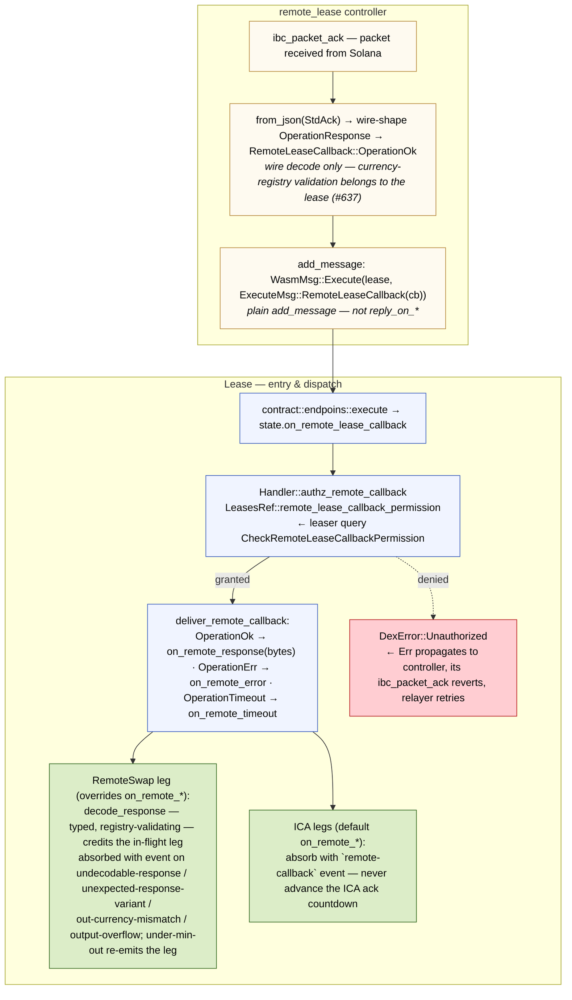
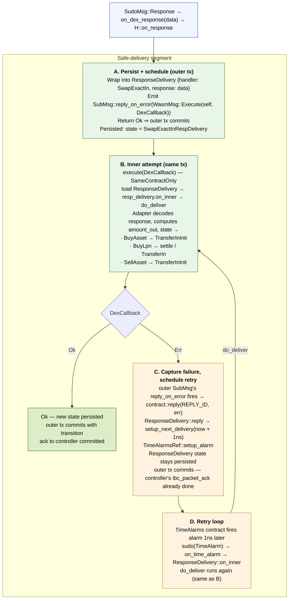

# Remote-Lease Callback — Execution Flow inside a Lease Instance

Trace of a callback delivered to the Lease contract via
`ExecuteMsg::RemoteLeaseCallback`. Two distinct segments:

1. **Controller → lease dispatch** — auth at the lease, then direct
   routing into the state's `on_remote_*` entry points. The remote-swap
   leg processes the acknowledgment **directly** — there is no
   `ResponseDelivery` hop on this path; content problems are absorbed
   with events so the controller's ack always commits.
2. **Safe-delivery segment** (`ResponseDelivery` + `reply_on_error` +
   `TimeAlarms` retry loop, boxes **A**–**D**) — applies to the
   **still-ICA legs** driven by `SudoMsg` (transfer-out, transfer-in,
   the repay/liquidation swaps). Controller callbacks never route
   through it.

## Controller → lease dispatch



A synchronous `Err` escapes the lease only for faults whose retry
belongs to the relayer: the auth mismatch above, serialization, and
storage failures. Everything content-shaped — a payload that does not
decode, names a currency outside the registry, carries the wrong
operation variant, or overflows — is absorbed with a distinct event
reason so the controller's `ibc_packet_ack` commits.

## Safe-delivery segment — still-ICA legs (`SudoMsg` path)



## What the four safe-delivery boxes guarantee

### A — Persist + schedule (outer tx)

The lease's `on_response` does the absolute minimum: store the raw
response inside `ResponseDelivery` state, emit a *self-call* `SubMsg::reply_on_error(DexCallback)`, return `Ok`.

Once this returns `Ok`, the outer transaction — which also contains the
controller's `ibc_packet_ack` write — commits atomically. The controller
**never sees an `Err`** originating in the inner business logic; only
storage / serialization errors here could propagate (and that's the
infallibility contract the implementation upholds).

### B — Inner attempt (same tx, sub-message)

`DexCallback` runs as a sub-message of the outer tx. It loads the
persisted `ResponseDelivery`, decodes the buffered response, computes
the swap outcome (e.g. `amount_out`), and transitions to the next state.
If this branch succeeds, the outer tx commits with the new state and
the `ResponseDelivery` wrapper is gone in one atomic step.

Permission is `SameContractOnly` — `DexCallback` is unreachable from
any external caller.

### C — Capture failure, schedule retry

If `DexCallback` returns `Err`, the **outer** SubMsg's
`reply_on_error` fires `contract::reply(REPLY_ID, err)`. `ResponseDelivery::reply` calls `setup_next_delivery` which schedules a
`TimeAlarms` alarm `now + 1ns`. The `ResponseDelivery` state stays
persisted (response still buffered, no transition yet); the outer tx
still commits cleanly with the alarm scheduled.

Critical property: the controller's `ibc_packet_ack` is **already
done**. The relayer is not involved in recovery. From this point on,
the retry is a purely local concern of the lease + `TimeAlarms`.

### D — Retry loop

The `TimeAlarms` contract fires the alarm. The lease's `on_time_alarm`
routes into `ResponseDelivery::on_inner` again, which re-runs the same
`do_deliver` step as B. Either it succeeds — transition out, normal
state — or `reply_on_error` fires again and schedules another `now +
1ns` alarm. The loop continues until success.

`ExecuteMsg::Heal()` is the operator escape hatch if the loop is stuck
on a permanently-unrecoverable state.

## Three properties that make this safe

1. **Outer `Ok` is unconditional.** The lease's `on_response` is
   engineered so its only failure paths are storage / serialization
   errors. Real business-logic failure is deferred to B/C. The
   controller's ack-commit is decoupled from inner success.

2. **No duplicate state writes on failure.** B's failure rolls back its
   sub-message's state mutations — only the C path
   (`setup_next_delivery`) commits to the outer tx, alongside the
   still-buffered `ResponseDelivery`. There are no half-applied
   transitions ever visible on-chain.

3. **The retry is host-driven, not relayer-driven.** Once the outer ack
   commits, the relayer is done with this packet. Recovery is a local
   concern of the lease + `TimeAlarms` contract. The controller is
   never invoked again for the same packet.

## Transport comparison (ICA legs vs. remote legs)

| Stage | ICA legs (SudoMsg) | Remote legs (ExecuteMsg::RemoteLeaseCallback) |
|-------|--------------------|-----------------------------------------------|
| Outer transport | `SudoMsg::Response` (chain-delivered) | `WasmMsg::Execute` from the controller's `ibc_packet_ack` / `ibc_packet_timeout` |
| Auth gate | Implicit (Sudo privilege) | Leaser query (`CheckRemoteLeaseCallbackPermission` vs `Config.remote_lease_controller`) |
| Dispatch | `data` enters `on_dex_response` → safe-delivery boxes A–D | `deliver_remote_callback` → `on_remote_response/error/timeout`; `RemoteSwap` processes directly, ICA legs absorb |
| Content failure | retried locally via the A–D loop | absorbed with a distinct event reason; ack commits |

## Outbound open-side lifecycle (issue #142)

The lease now drives the remote-lease channel directly for the open flow.

```
RequestLoan ──open loan──▶ OpenLease
                              │
                              │ Factory::open → controller → IBC packet
                              │
                              ▼
                  ┌───────────────────────┐
                  │ controller ack (UNORDERED) │
                  └───────────────────────┘
                     │             │
        OperationOk  │             │ OperationErr / OperationTimeout
        (OpenLease   │             │
        + PDA)       │             ▼
                     │       atomic batch: LPP repay + downpayment refund
                     │             + finalize_lease + emit
                     │             `wasm-ls-remote-lease-open-failed`
                     │             │
                     ▼             ▼
        super::buy_asset::start    OpenFailed  (terminal)
        (ICA open + transfer-out,  authenticated late-ack absorber:
        swap legs via RemoteSwap)  emits `wasm-ls-remote-lease-late-ack`
```

`OpenLease::on_remote_lease_callback` authenticates `info.sender` via `LeasesRef::remote_lease_callback_permission` before dispatching, identical to the in-flight DexState gate documented above. `OpenFailed` runs the same check — every callback handler that returns `Ok` is authz-gated, regardless of idempotence.

`super::buy_asset::start` still opens the ICA account and transfers the funds out over ICA, but the swap legs run through the remote-lease controller (`RemoteSwap` — sequential single-coin legs, `acks_left` countdown, pinned per-leg `min_out`). The remaining lifecycle stages (drain-home TransferOut, CloseLease, the repay/liquidation swaps) still ride ICA and migrate in later phases.

An `OperationOk` ack carrying any operation other than `OpenLease` (a `CloseLease` / `Swap` / `TransferOut` response against an in-flight open) can only originate from a buggy or hostile counterparty. The lease treats it exactly like `OperationErr`: it refunds the customer, finalises, and moves to `OpenFailed` with a synthesised `unexpected operation response: …` reason. It does **not** return `Err` — an error would revert the controller's `ibc_packet_ack`, stranding the relayer and freezing the lease in `OpenLease`. Operators see the same `wasm-ls-remote-lease-open-failed` event and audit the counterparty per the runbook.

## Storage: v9 → v10 → v11 (refuse-migrate)

v10 makes `LeaseDTO.remote_lease_id` a non-optional Solana PDA, which is binary-incompatible with the v9 layout. v11 reshapes the opening-swap state: the `BuyAsset` spec gains the controller address and slippage bound, and the swap leg moves from the ICA `SwapExactIn` to the `RemoteSwap` transport. The `migrate` entry point **rejects unconditionally** (`ContractError::UnsupportedMigration`):

- **Mainnet** carries zero pre-v11 remote-lease positions, so refusing is strictly safer than risking a silent deserialise failure on the first post-upgrade load.
- A v9 lease has no meaningful `remote_lease_id` to synthesise — its `dex_account` is an ICA host on the DEX chain, not a Solana PDA — and a pre-v11 opening state has no transport to resume on, so a "real" migration would only invent permanent sentinels.

**Operational procedure for non-mainnet (devnet/testnet/local):** drain every pre-v11 lease to a terminal state *before* upgrading the lease code. There is no `ExecuteMsg` escape hatch for a stranded pre-v11 lease, so the drain is a prerequisite, not a recovery step.

## In-lease decoder shape

The remote-swap acknowledgment is JSON: the controller forwards the
wire-shaped `OperationResponse` (#637), and the `RemoteSwap` leg's
`decode_response` parses the typed, registry-validating twin from those
bytes — a registry miss is absorbed as `undecodable-response` rather
than erred.
