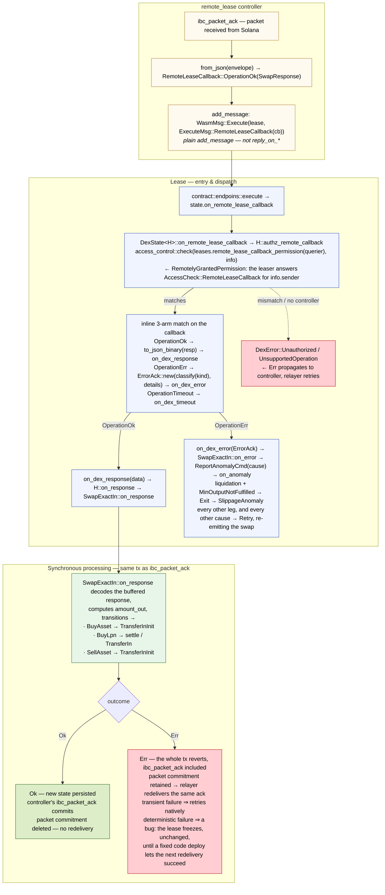

# Remote-Lease Callback — Execution Flow inside a Lease Instance

Trace of a swap callback delivered to the Lease contract via
`ExecuteMsg::RemoteLeaseCallback`. Controller-delivered callbacks are
processed **synchronously**: the real decode/transition runs inside the
`RemoteLeaseCallback` execute, and an `Err` reverts the controller's
`ibc_packet_ack`, so the relayer redelivers the same ack — native
"error ⇒ try again". The **safe-delivery segment** (`ResponseDelivery`
+ `reply_on_error` + `TimeAlarms` retry loop, boxes **A**–**D** below)
remains only on the one leg still answered over Neutron `SudoMsg`: the
outbound transfer-out (#763).

## Whole flow


```mermaid
flowchart TD
    classDef ctrl   fill:#fefaf0,stroke:#b6883a,color:#000;
    classDef lease  fill:#f0f4ff,stroke:#3a5dbe,color:#000;
    classDef safeA  fill:#e8f5e9,stroke:#3a7d3a,color:#000;
    classDef safeB  fill:#e8f5e9,stroke:#3a7d3a,color:#000;
    classDef safeC  fill:#fff3e0,stroke:#b6883a,color:#000;
    classDef safeD  fill:#fff3e0,stroke:#b6883a,color:#000;
    classDef ok     fill:#dcedc8,stroke:#33691e,color:#000;
    classDef err    fill:#ffcdd2,stroke:#b71c1c,color:#000;

    subgraph Controller[remote_lease controller]
        direction TB
        Ack["ibc_packet_ack — packet received from Solana"]:::ctrl
        Decode["from_json(envelope) → RemoteLeaseCallback::OperationOk(SwapResponse)"]:::ctrl
        WasmExec["add_message: WasmMsg::Execute(lease, ExecuteMsg::RemoteLeaseCallback(cb))<br/><i>plain add_message — not reply_on_*</i>"]:::ctrl
        Ack --> Decode --> WasmExec
    end

    subgraph LeaseEntry[Lease — entry & dispatch]
        direction TB
        ExecEntry["contract::endpoins::execute → state.on_remote_lease_callback"]:::lease
        Auth["DexState&lt;H&gt;::on_remote_lease_callback → H::authz_remote_callback<br/>access_control::check(leases.remote_lease_callback_permission(querier), info)<br/>← RemotelyGrantedPermission: the leaser answers AccessCheck::RemoteLeaseCallback for info.sender"]:::lease
        Classify["inline 3-arm match on the callback<br/>OperationOk → to_json_binary(resp) → on_dex_response<br/>OperationErr → ErrorAck::new(classify(kind), details) → on_dex_error<br/>OperationTimeout → on_dex_timeout"]:::lease
        DispatchResp["on_dex_response(data) → H::on_response → SwapExactIn::on_response"]:::lease
        DispatchErr["on_dex_error(ErrorAck) → SwapExactIn::on_error → ReportAnomalyCmd(cause) → on_anomaly<br/>liquidation + MinOutputNotFulfilled → Exit → SlippageAnomaly<br/>every other leg, and every other cause → Retry, re-emitting the swap"]:::lease
        ExecEntry --> Auth -->|matches| Classify
        Classify -->|OperationOk| DispatchResp
        Classify -->|OperationErr| DispatchErr
        Auth -. mismatch / no controller .-> AuthErr["DexError::Unauthorized / UnsupportedOperation<br/>← Err propagates to controller, relayer retries"]:::err
    end

    subgraph SyncProcessing[Synchronous processing — same tx as ibc_packet_ack]
        direction TB
        S["SwapExactIn::on_response decodes the buffered response,<br/>computes amount_out, transitions →<br/>· BuyAsset → TransferInInit<br/>· BuyLpn → settle / TransferIn<br/>· SellAsset → TransferInInit"]:::safeB
        SSplit{outcome}
        SOk["Ok — new state persisted<br/>controller's ibc_packet_ack commits<br/>packet commitment deleted — no redelivery"]:::ok
        SErr["Err — the whole tx reverts, ibc_packet_ack included<br/>packet commitment retained → relayer redelivers the same ack<br/>transient failure ⇒ retries natively<br/>deterministic failure ⇒ a bug: the lease freezes, unchanged,<br/>until a fixed code deploy lets the next redelivery succeed"]:::err

        S --> SSplit
        SSplit -->|Ok| SOk
        SSplit -->|Err| SErr
    end

    WasmExec --> ExecEntry
    DispatchResp --> S
```

## Why synchronous processing is safe on the controller legs

1. **`Ok` and the ack commit together.** The lease transition and the
   controller's `ibc_packet_ack` write live in the same transaction: both
   advance or neither does. On `Ok` the packet commitment is deleted, so
   the same ack can never be delivered twice.

2. **`Err` retains the commitment against unchanged state.** A revert
   rolls back every write in the tx, so the relayer redelivers the same
   ack against exactly the state that failed — re-running the handler is
   idempotent by construction.

3. **Failure classification is the contract.** A transient failure
   succeeds on a later redelivery. A deterministic failure is a bug: the
   lease freezes, unchanged and observable, until a fixed code deploy
   lets the next redelivery succeed. No absorber hides it, no local
   retry loop burns alarms on it.

## The safe-delivery segment — outbound transfer-out only

The outbound transfer-out (Nolus→DEX: funding the account at open,
forwarding the repay payment) is still emitted as a Neutron
`InterChainMsg::IbcTransfer` and answered over `SudoMsg`. A Neutron sudo
callback runs under a fixed `contractmanager` gas cap and, on failure,
the packet is parked in Neutron's failure queue awaiting a manual
`ResubmitFailure` — it is **not** relayer-retried. That leg therefore
keeps the four-box safe-delivery machinery (`TransferOutRespDelivery`):

- **A — persist + schedule (outer tx).** `on_response` stores the raw
  response inside `ResponseDelivery`, emits a self-call
  `SubMsg::reply_on_error(DexCallback)`, returns `Ok`; the gas-capped
  sudo callback does no business logic.
- **B — inner attempt (same tx).** `execute(DexCallback)` —
  `SameContractOnly` — loads the persisted wrapper and runs the real
  transition; on `Ok` the wrapper is gone in one atomic step.
- **C — capture failure, schedule retry.** `reply_on_error` fires
  `contract::reply(REPLY_ID, err)`; `setup_next_delivery` schedules a
  `TimeAlarms` alarm `now + 1ns`; the outer tx still commits.
- **D — retry loop.** The alarm re-runs delivery until success. The loop is
  the only driver: the wrapper implements no `heal`, so `ExecuteMsg::Heal()`
  on a persisted wrapper is rejected rather than acting as an escape hatch.

Operator note: while a `TransferOutRespDelivery` persists (box B failed and
box D is retrying), a sibling funding ack dispatching on it fails and parks
in Neutron's failure queue. The retry loop unwraps the state by itself once
the transient (typically an oracle outage) clears — but a stuck wrapper
reports the same stage as its inner `TransferOut`, so the current stage is
not the all-clear. Resubmit with `ResubmitFailure` only once the state
query has advanced to the *next* stage (`SwapExactIn`), which observably
proves the unwrap.

## Error acknowledgements — the classification seam

`ExecuteMsg::RemoteLeaseCallback` carries a `RemoteError { kind, message }`,
already parsed from the acknowledgement's `[<token>] ` frame by the
controller's `ack_to_callback` (see `docs/remote-lease-wire-contract.md`).
`DexState<H>::on_remote_lease_callback` is where that typed value stops:
`classify` projects the three wire kinds onto the two-valued
`dex::AnomalyCause`, and the pair travels on as `dex::ErrorAck` — the cause
to branch on plus a `platform::remote::ErrorDetails` for troubleshooting.
The projection is exhaustive with no wildcard arm, so a fourth wire kind is
a compile error here rather than a silent `Other`. Below the seam `dex`
knows nothing of the counterparty's error vocabulary.

`SwapExactIn::on_error` hands the cause to the leg through
`ReportAnomalyCmd`, and the leg answers with an `AnomalyTreatment`:

- **Liquidation sell-asset** is the only leg that reads the cause, because
  it is the only one whose calculator quotes a real floor from the oracle.
  `MinOutputNotFulfilled` exits to the `SlippageAnomaly` terminal, which
  emits `ls-slippage-anomaly` and is resolvable only through the
  anomaly-manager-gated `heal`. Any other cause retries.
- **Opening buy-asset, repay buy-LPN, and customer / auto close** accept any
  non-zero swap, so no output can be below their floor and every cause —
  including `MinOutputNotFulfilled` — retries (#756, decisions D4/D6/D7).

Two constraints hold the retry branch in place. It must return `Ok` and
re-emit: the controller dispatches the callback with a plain `add_message`,
so an `Err` reverts `ibc_packet_ack` and leaves the relayer redelivering the
same acknowledgement forever. And it is unbounded — there is no attempt
counter anywhere, so a deterministic non-floor cause re-emits until an
operator intervenes.

`ErrorAck` deliberately carries no serde. The error path runs synchronously
inside one message execution — as does, since #763, the success path — so
the cause crosses no message or storage boundary. The remaining ICA path
(`SudoMsg::Error`, the outbound transfer-out) has no code frame to parse and
constructs `AnomalyCause::Other`; the only leg reachable through it re-emits
regardless of the cause.

## What changed in #141 (vs. today's SudoMsg path)

| Stage | Today (SudoMsg) | After #141 (ExecuteMsg::RemoteLeaseCallback) |
|-------|-----------------|----------------------------------------------|
| Outer transport | `SudoMsg::Response` (chain-delivered) | `ExecuteMsg::RemoteLeaseCallback` (controller-delivered via `WasmMsg::Execute`) |
| Auth gate | Implicit (Sudo privilege) | `info.sender == remote_lease` at `DexState::on_remote_lease_callback` |
| Classify | `data` enters directly into `on_dex_response` | an inline 3-arm `match` on the callback variant → `on_dex_response` / `on_dex_error(ErrorAck)` / `on_dex_timeout` |
| A–D safe-delivery boxes | on every leg | dropped from the controller legs (#763); retained only for the outbound transfer-out (`SudoMsg`) |

## Outbound open-side lifecycle (issue #142)

The lease now drives the remote-lease channel directly for the open flow.

```
RequestLoan ──open loan──▶ OpenLease
                              │
                              │ Factory::open → controller → IBC packet
                              │
                              ▼
                  ┌───────────────────────┐
                  │ controller ack (UNORDERED) │
                  └───────────────────────┘
                     │             │
        OperationOk  │             │ OperationErr / OperationTimeout
        (OpenLease   │             │
        + PDA)       │             ▼
                     │       atomic batch: LPP repay + downpayment refund
                     │             + finalize_lease + emit
                     │             `wasm-ls-remote-lease-open-failed`
                     │             │
                     ▼             ▼
        super::buy_asset::start    OpenFailed  (terminal)
        (derives dex::Account      authenticated late-ack absorber:
        from remote_lease, no ICA) emits `wasm-ls-remote-lease-late-ack`
```

`OpenLease::on_remote_lease_callback` authenticates `info.sender` via `LeasesRef::remote_lease_callback_permission` before dispatching, identical to the in-flight DexState gate documented above. `OpenFailed` runs the same check — every callback handler that returns `Ok` is authz-gated, regardless of idempotence.

`super::buy_asset::start` no longer opens a Cosmos ICA: `on_open_lease_ack` converts the acked `RemoteLeaseId` directly into a `platform::ica::HostAccount`, builds `dex::Account` from it, funds that account via `IbcTransfer`, then buys the asset. The swap and the repay/close collateral **transfer-in** now route over the remote-lease controller (`WasmMsg::Execute` of `ExecuteMsg::Swap` / `ExecuteMsg::TransferOut`, no ICA); only the outbound transfer-out (Nolus→DEX — funding the account at open and forwarding the repay payment) still submits over ICA (`submit_tx`).

An `OperationOk` ack carrying any operation other than `OpenLease` (a `CloseLease` / `Swap` / `TransferOut` response against an in-flight open) can only originate from a buggy or hostile counterparty. The lease treats it exactly like `OperationErr`: it refunds the customer, finalises, and moves to `OpenFailed` with a synthesised `unexpected operation response: …` reason. It does **not** return `Err` — an error would revert the controller's `ibc_packet_ack`, stranding the relayer and freezing the lease in `OpenLease`. Operators see the same `wasm-ls-remote-lease-open-failed` event and audit the counterparty per the runbook.

## Storage: v9 → v10 (refuse-migrate)

v10 makes `LeaseDTO.remote_lease_id` a non-optional Solana PDA, which is binary-incompatible with the v9 layout. The `migrate` entry point therefore **rejects unconditionally** (`ContractError::UnsupportedMigration`):

- **Mainnet** carries zero v9 leases (plan §10.A.1), so refusing is strictly safer than risking a silent deserialise failure on the first post-upgrade load.
- A v9 lease has no meaningful `remote_lease_id` to synthesise — its `dex_account` is an ICA host on the DEX chain, not a Solana PDA — so a "real" migration would only invent a permanent sentinel.

**Operational procedure for non-mainnet (devnet/testnet/local):** drain every v9 lease to a terminal state *before* upgrading the lease code to v10. There is no `ExecuteMsg` escape hatch for a stranded v9 lease, so the drain is a prerequisite, not a recovery step.

## Closed: in-lease decoder shape

The `OperationOk(SwapResponse)` decoder runs synchronously inside the
`RemoteLeaseCallback` execute (#763); the protobuf-vs-JSON shape switch
tracked here previously moves with the Phase-4 swap replacement work.
